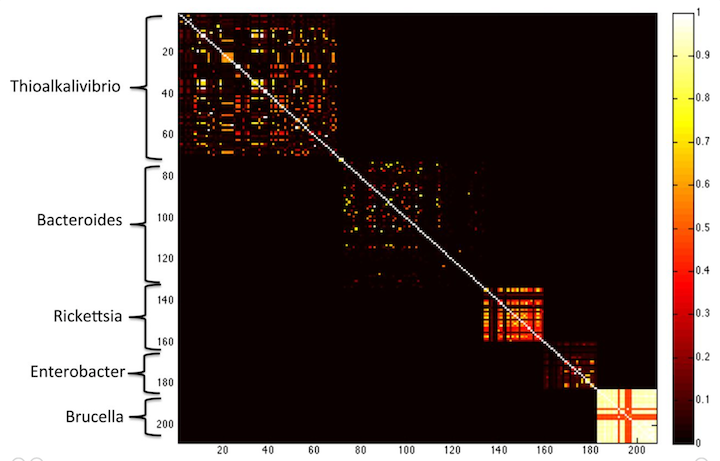
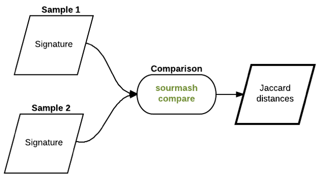
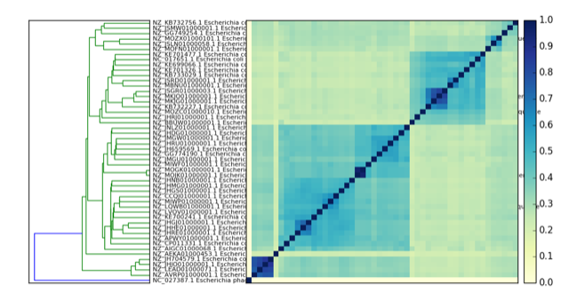

# K-mers, k-mer specificity, and comparing samples with k-mer Jaccard distance.

## Objectives

1. Discuss the power of k-mers 
2. Compare reads to assemblies 
3. Compare datasets and build a tree
4. Determine what's in a metagenome by classifying reads into taxa 

## But first! Revisiting our mystery sample!

### Calculate some signatures from our reads & assembly.

Log into your class server (should be `class-XX`). Note, if you can't connect directly to `class-XX` you can connect in first to `class.mbl.edu` and then `ssh class-XX`.

Activate conda as before:
```
export PATH="/class/stamps-software/miniconda3/bin:$PATH"
```

Create a working directory for this section:
```
mkdir ~/kmers
cd ~/kmers
```

Copy in some files from Titus's account:

```
cp ~cbrown/workflows/*.fq.gz .
cp ~cbrown/workflows/mystery.assembly/final.contigs.fa ./assembly.fa
ls
```

Calculate sourmash signatures from the reads and the assembly.

```
sourmash compute -k 31 --scaled=1000 assembly.fa --merge="Assembly" -o assembly.sig

sourmash compute -k 31 --scaled=1000 sample.R*.fq.gz --merge="Reads" -o reads.sig
```

You should now have `reads.sig` and `assembly.sig`.

### Compare reads and assembly!

Calculate Jaccard similarity:

```
sourmash search reads.sig assembly.sig
sourmash search assembly.sig reads.sig
```
note that it's symmetric!

Calculate Jaccard containment:

```
sourmash search reads.sig assembly.sig --containment
sourmash search assembly.sig reads.sig --containment
```
note that it's not symmetric!

<!--
 mbl% sourmash search reads.sig assembly.sig
 
similarity   match
----------   -----
 44.1%       Reads
 
mbl% sourmash search reads.sig assembly.sig --containment
 
1 matches:
similarity   match
----------   -----
 44.1%       Assembly
  
mbl% sourmash search assembly.sig reads.sig --containment
  
1 matches:
similarity   match
----------   -----
 99.9%       Reads
-->

How do you interpret this? let's do some Venn diagramming...

### What's our mystery sample?

One thing we can do with Jaccard similarity is *search all of genbank*.
Let's do that with our mystery sample!

#### Search the assembly against genbank for the best Jaccard similarity:
```
sourmash search assembly.sig /class/stamps-shared/sourmash-db/genbank-d2-k31.sbt.json
```

and you will see

```
similarity   match
----------   -----
 51.0%       FQVV01000014.1 Tenacibaculum mesophilum strain DSM 13764 ...
 48.2%       LDOD01000001.1 Tenacibaculum mesophilum strain HMG1 scaff...
```

#### "Gather" the assembly against genbank for the best nonoverlappiung Jaccard containment (as a metagenome):

```
sourmash gather assembly.sig /class/stamps-shared/sourmash-db/genbank-d2-k31.sbt.json
```

and you will see

```
overlap     p_query p_match
---------   ------- -------
2.3 Mbp       63.4%   72.4%    FQVV01000014.1 Tenacibaculum mesophil...
2.3 Mbp        8.9%    9.5%    LDOD01000001.1 Tenacibaculum mesophil...
148.0 kbp      0.4%    0.5%    JADN01000003.1 Tenacibaculum sp. 47A_...
found less than 8.0 kbp in common. => exiting

found 3 matches total;
the recovered matches hit 72.7% of the query
```

#### Note you can also "gather" the reads against genbank:

```
sourmash gather reads.sig /class/stamps-shared/sourmash-db/genbank-d2-k31.sbt.json
```

and you will see:
```
overlap     p_query p_match
---------   ------- -------
2.4 Mbp       27.9%   73.0%    FQVV01000014.1 Tenacibaculum mesophil...
2.3 Mbp        3.9%    9.6%    LDOD01000001.1 Tenacibaculum mesophil...
found less than 16.0 kbp in common. => exiting

found 2 matches total;
the recovered matches hit 31.8% of the query
```

#### And you can also use a lowest common ancestor algorithm to inspect the assembly:

```
sourmash lca gather assembly.sig /class/stamps-shared/sourmash-db/genbank-k31.lca.json.gz
```

which gives some interesting results, and some weird results:

```
overlap     p_query p_match
---------   ------- --------
2.9 Mbp      71.1%   63.6%      Tenacibaculum mesophilum
40.0 kbp      1.0%    0.0%      Escherichia coli (** 2 equal matches)
20.0 kbp      0.5%    0.7%      Tenacibaculum sp. 47A_GOM-205m
10.0 kbp      0.2%    0.3%      Mesonia phycicola

27.1% (1.1 Mbp) of hashes have no assignment.
```

### Questions to ask:

* what is our mystery sample?
* we see that E. coli shows up with one analysis - which analysis or analyses should we believe?
* how might we move to be on more certain ground?

Summary statement: these are ~low resolution analyses. Don't trust
'em completely - but you can use 'em to guide your next analyses.

## K-mers!

(You can read a higher level discussion [in this blog post](http://ivory.idyll.org/blog/2017-something-about-kmers.html))

K-mers are a fairly simple concept that turn out to be tremendously powerful.

A "k-mer" is a word of DNA that is k long:

```
ATTG - a 4-mer
ATGGAC - a 6-mer
```

Typically we extract k-mers from genomic assemblies or read data sets by running a k-length window across all of the reads and sequences -- e.g. given a sequence of length 16, you could extract 11 k-mers of length six from it like so:

```
AGGATGAGACAGATAG
```
becomes the following set of 6-mers:
```
AGGATG
 GGATGA
  GATGAG
   ATGAGA
    TGAGAC
     GAGACA
      AGACAG
       GACAGA
        ACAGAT
         CAGATA
          AGATAG
```

k-mers are most useful when they're *long*, because then they're *specific*. That is, if you have a 31-mer taken from a human genome, it's pretty unlikely that another genome has that exact 31-mer in it.  (You can calculate the probability if you assume genomes are random: there are 4<sup>31</sup> possible 31-mers, and 4<sup>31</sup> = 4,611,686,018,427,387,904\.  So, you know, a lot.)

The important concept here is that **long k-mers are species specific**. We'll go into a bit more detail later.

## K-mers and assembly graphs

One of the three major ways that genome assembly works is by taking reads, breaking them into
k-mers, and then "walking" from one k-mer to the next to bridge between reads.  To see how this works, let's take the 16-base sequence above, and add another overlapping sequence:

```
AGGATGAGACAGATAG
    TGAGACAGATAGGATTGC
```

One way to assemble these together is to break them down into k-mers -- 

becomes the following set of 6-mers:
```
AGGATG
 GGATGA
  GATGAG
   ATGAGA
    TGAGAC
     GAGACA
      AGACAG
       GACAGA
        ACAGAT
         CAGATA
          AGATAG -> off the end of the first sequence
           GATAGG <- beginning of the second sequence
            ATAGGA
             TAGGAT
              AGGATT
               GGATTG
                GATTGC
```

and if you walk from one 6-mer to the next based on 5-mer overlap, you get the assembled sequence:

```
AGGATGAGACAGATAGGATTGC
```

Graphs of many k-mers together are called De Bruijn graphs, and assemblers like MEGAHIT and SOAPdenovo are De Bruijn graph assemblers - they use k-mers underneath.

## Why k-mers, though? Why not just work with the full read sequences?

Computers *love* k-mers because there's no ambiguity in matching them. You either have an exact match, or you don't.  And computers love that sort of thing!

Basically, it's really easy for a computer to tell if two reads share a k-mer, and it's pretty easy for a computer to store all the k-mers that it sees in a pile of reads or in a genome.

## Long k-mers are species specific

So, we've said long k-mers (say, k=31 or longer) are pretty species specific. Is that really true?

Yes! Check out this figure from the [MetaPalette paper](http://msystems.asm.org/content/1/3/e00020-16):



here, Koslicki and Falush show that k-mer similarity works to group microbes by genus, at k=40\. If you go longer (say k=50) then you get only very little similarity between different species.

I looked into this [recently](http://ivory.idyll.org/blog/2017-how-specific-kmers.html) - here is an estimate of how many 31-mers are specific at each
level of the Genbank taxonomy:

```
superkingdom: 38,077,000 (0.4%)
phylum: 24,627,000 (0.3%)
class: 39,306,000 (0.4%)
order: 66,423,000 (0.7%)
family: 97,908,000 (1.1%)
genus: 1,103,223,000 (12.0%)
species: 7,818,876,000 (85.1%)
```

## Using k-mers to compare samples against each other

So, one thing you can do is use k-mers to compare genomes to genomes, or read data sets to read data sets: data sets that have a lot of similarity probably are similar or even the same genome.

One metric you can use for this comparisons is the Jaccard distance, which is calculated by asking how many k-mers are *shared* between two samples vs how many k-mers in total are in the combined samples.

```
only k-mers in both samples
----------------------------
all k-mers in either or both samples
```

A Jaccard distance of 1 means the samples are identical; a Jaccard distance of 0 means the samples are completely different.

This is a great measure and it can be used to search databases and cluster unknown genomes and all sorts of other things!  The only real problem with it is that there are a *lot* of k-mers in a genome -- a 5 Mbp genome (like E. coli) has 5 m k-mers!

About two years ago, [Ondov et al. (2016)](https://genomebiology.biomedcentral.com/articles/10.1186/s13059-016-0997-x) showed that [MinHash approaches](https://en.wikipedia.org/wiki/MinHash) could be used to estimate Jaccard distance using only a small fraction (1 in 10,000 or so) of all the k-mers.

The basic idea behind MinHash is that you pick a small subset of k-mers to look at, and you use those as a proxy for *all* the k-mers.  The trick is that you pick the k-mers randomly but consistently: so if a chosen k-mer is present in two data sets of interest, it will be picked in both. This is done using a clever trick that we can try to explain to you in class - but either way, trust us, it works!

We have implemented a MinHash approach in our [sourmash software](https://github.com/dib-lab/sourmash/), which can do some nice things with samples.  We'll show you some of these things next!

## Installing sourmash

To install sourmash, enable
[bioconda](https://angus.readthedocs.io/en/2018/jetstream-bioconda-config.html#what-is-bioconda)
and run:

```
conda install -y sourmash
```
...but this has already been done for you on the STAMPS cluster.

So, instead, you just need to activate conda:

```
export PATH="/class/stamps-software/miniconda3/bin:$PATH"
```

## Generate a signature for Illumina reads

[](_static/Sourmash_flow_diagrams_QC.png)


[](_static/Sourmash_flow_diagrams_compute.png)

Compute a scaled MinHash signature from our reads:

## Compare reads to assemblies

[](_static/Sourmash_flow_diagrams_search.png)

## Compare many signatures and build a tree.

But we don't have to stick with doing 1-1 comparisons. What else can we do?
We can build distance matrices of _many_ signatures. Let's give it a try:

[](_static/Sourmash_flow_diagrams_compare.png)

```
mkdir ecoli_many_sigs
cd ecoli_many_sigs

curl -O -L https://github.com/dib-lab/sourmash/raw/master/data/eschericia-sigs.tar.gz

tar xzf eschericia-sigs.tar.gz
rm eschericia-sigs.tar.gz

cd ../

sourmash index -k 31 ecolidb ecoli_many_sigs/*.sig
```

Compare all the things:

```
sourmash compare ecoli_many_sigs/* -o ecoli_cmp
```

and then plot:

```
sourmash plot --pdf --labels ecoli_cmp
```

which will produce a file `ecoli_cmp.matrix.pdf` and `ecoli_cmp.dendro.pdf`
which you can then download via RStudio and view on your local computer.

Here's a PNG version:

[](_static/ecoli_cmp.matrix.png)

How do you interpret this?

What does the little dot on the lower left mean? What is that and why is
it occurring?

## What's in my metagenome?

Sourmash comes with a bunch of 
[databases](http://sourmash.rtfd.io/en/latest/databases.html). I've
pre-installed two of them for you -- 

* /class/stamps-shared/sourmash-db/genbank-d2-k31.sbt.json - this is an SBT search database of all genbank microbes
* /class/stamps-shared/sourmash-db/genbank-k31.lca.json - this is an LCA search database of all genbank microbes

----

Here is gather running on a signature generated
from some sequences that assemble (but don't align to known genomes)
from the
[Shakya et al. 2013 mock metagenome paper](https://www.ncbi.nlm.nih.gov/pubmed/23387867).

```
wget https://github.com/dib-lab/sourmash/raw/master/doc/_static/shakya-unaligned-contigs.sig
sourmash lca gather shakya-unaligned-contigs.sig genbank-k31.lca.json
```

This should yield:
```
loaded 1 LCA databases. ksize=31, scaled=10000
loaded query: mqc500.QC.AMBIGUOUS.99.unalign... (k=31)

overlap     p_query p_match 
---------   ------- --------
1.8 Mbp      14.6%    9.1%      Fusobacterium nucleatum
1.0 Mbp       7.8%   16.3%      Proteiniclasticum ruminis
1.0 Mbp       7.7%   25.9%      Haloferax volcanii
0.9 Mbp       7.4%   11.8%      Nostoc sp. PCC 7120
0.9 Mbp       7.0%    5.8%      Shewanella baltica
0.8 Mbp       6.0%    8.6%      Desulfovibrio vulgaris
0.6 Mbp       4.9%   12.6%      Thermus thermophilus
0.6 Mbp       4.4%   11.2%      Ruegeria pomeroyi
480.0 kbp     3.8%    7.6%      Herpetosiphon aurantiacus
410.0 kbp     3.3%   10.5%      Sulfitobacter sp. NAS-14.1
150.0 kbp     1.2%    4.5%      Deinococcus radiodurans (** 1 equal matches)
150.0 kbp     1.2%    8.2%      Thermotoga sp. RQ2
140.0 kbp     1.1%    4.1%      Sulfitobacter sp. EE-36
130.0 kbp     1.0%    0.7%      Streptococcus agalactiae (** 1 equal matches)
100.0 kbp     0.8%    0.3%      Salinispora arenicola (** 1 equal matches)
100.0 kbp     0.8%    4.2%      Fusobacterium sp. OBRC1
60.0 kbp      0.5%    0.7%      Paraburkholderia xenovorans
50.0 kbp      0.4%    3.2%      Methanocaldococcus jannaschii (** 2 equal matches)
50.0 kbp      0.4%    0.3%      Bacteroides vulgatus (** 1 equal matches)
50.0 kbp      0.4%    2.6%      Sulfurihydrogenibium sp. YO3AOP1
30.0 kbp      0.2%    0.7%      Fusobacterium hwasookii (** 3 equal matches)
30.0 kbp      0.2%    0.0%      Pseudomonas aeruginosa (** 2 equal matches)
30.0 kbp      0.2%    1.6%      Persephonella marina (** 1 equal matches)
30.0 kbp      0.2%    0.4%      Zymomonas mobilis
20.0 kbp      0.2%    1.1%      Sulfurihydrogenibium yellowstonense (** 6 equal matches)
20.0 kbp      0.2%    0.5%      Ruminiclostridium thermocellum (** 5 equal matches)
20.0 kbp      0.2%    0.1%      Streptococcus parasanguinis (** 4 equal matches)
20.0 kbp      0.2%    0.8%      Fusobacterium sp. HMSC064B11 (** 2 equal matches)
20.0 kbp      0.2%    0.4%      Chlorobium phaeobacteroides (** 1 equal matches)
20.0 kbp      0.2%    0.7%      Caldicellulosiruptor bescii
10.0 kbp      0.1%    0.0%      Achromobacter xylosoxidans (** 53 equal matches)
10.0 kbp      0.1%    0.2%      Geobacter sulfurreducens (** 17 equal matches)
10.0 kbp      0.1%    0.5%      Fusobacterium sp. HMSC065F01 (** 15 equal matches)
10.0 kbp      0.1%    0.3%      Nitrosomonas europaea (** 14 equal matches)
10.0 kbp      0.1%    0.5%      Wolinella succinogenes (** 13 equal matches)
10.0 kbp      0.1%    0.5%      Thermotoga neapolitana (** 12 equal matches)
10.0 kbp      0.1%    0.5%      Thermus amyloliquefaciens (** 10 equal matches)
10.0 kbp      0.1%    0.1%      Desulfovibrio desulfuricans (** 9 equal matches)
10.0 kbp      0.1%    0.4%      Fusobacterium sp. CM22 (** 8 equal matches)
10.0 kbp      0.1%    0.2%      Desulfovibrio piger (** 7 equal matches)
10.0 kbp      0.1%    0.5%      Thermus kawarayensis (** 6 equal matches)
10.0 kbp      0.1%    0.5%      Pyrococcus furiosus (** 5 equal matches)
10.0 kbp      0.1%    0.5%      Aciduliprofundum boonei (** 4 equal matches)
10.0 kbp      0.1%    0.2%      Desulfovibrio sp. A2 (** 3 equal matches)
10.0 kbp      0.1%    0.3%      Desulfocurvus vexinensis (** 2 equal matches)
10.0 kbp      0.1%    0.0%      Enterococcus faecalis

22.1% (2.8 Mbp) of hashes have no assignment.

``` 

What do the columns here mean?

Why might some of things in a metagenome be unassigned?

----

It is straightforward to build your own databases for use with
`search` and `lca gather`; this is of interest if you have dozens or
hundreds of sequencing data sets in your group. Ping us if you want us
to write that up.

## Switch to presentation - what is actually going on above?

## Final thoughts on sourmash

Sourmash mostly implements algorithms that were already widely used
(but does so in the context of minhash downsampling, which makes it
much lighterweight).  In particular, the
[Kraken tool](https://ccb.jhu.edu/software/kraken/) does the same LCA
classification as sourmash.

Above, we've shown you a few things that you can use sourmash for.  Here
is a (non-exclusive) list of other uses that we've been thinking about --

* detect contamination in sequencing data;

* index and search private sequencing collections;

* search all of SRA for overlaps in metagenomes;

Chat with Titus if you are interested in these use cases!
